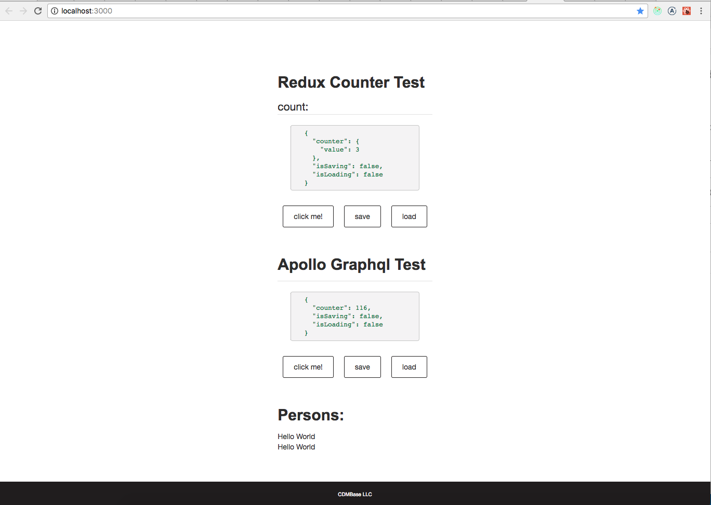

# Full Stack Packages

*Fullstack packages to develop and test end to end; to use as packages or work independently.*

Purpose: 
---
The idea is to create modules for each package so it can work independently as well as integrated to another project as packages. 

## Screenshot



Useful commands:
---
|command|Description|
|--------------------------|-----------|    
|`lerna clean`|                 - removes the node_modules directory from all packages. |
|`npm start`(deprecated)|       - starts the web server and backend server. Use `npm run spin:watch`|
|`npm run spin:watch`|         - starts the web server and backend server in watch mode.|
|`npm run spin:watch:debug`|    - starts the web server and backend server in debug and watch mode.|
|`npm run watch`|               - build the packages in watchmode (Useful for development)|
|`npm run lerna`|               - install external dependencies at the repo root so they're |`lable to all packages.|
|`npm run build`|               - build all the packages|
|`npm install`|                - runs `lerna` and `build`|
|`lerna publish`|               - publishes packages in the current Lerna project. |

Files explained:
---    
It uses `lerna.json` for creating the packages structure. Under packages you can create different modules based on its usage. For example:

     packages                    - Has the packages to organize the codebase into multi-package repositories.
         sample-core             - Core interfaces of the packages which can be shared between server and client.
         sample-server-core      - Core interfaces and its implementation code for Server.   
         sample-client-core      - Core interfaces and its implementation code for Client.
         sample-client-redux     - Redux's reducers and actions are defined. Which may use `@sample-stack\client-core` or `@sample-stack\core`
         sample-client-react     - React pure components and containers are defined. 
         sample-graphql-client   - Graphql Quries and Mutation for Client.
         sample-graphql-schema   - Graphql Schema for Server.
     servers                     - Has the packages to organize the codebase into multi-package repositories.
         frontend-server         - Frontend Client Server. This is useful to show demo of this package.
         backend-server          - Backend apollo server. 
    

## Getting Started

If you want to develop FullStack locally you must follow the following instructions:

* Fork or Clone this repository

* Install the project in your computer
1. Clone fullstack-pro locally
```
git clone https://github.com/cdmbase/fullstack-pro
cd fullstack-pro
```
2. Install dependencies.
```
npm install
```
3. Seed development database data
```
npm run db:seed
```
4. Start both client and server together
```
npm run spin:watch
```
still supports backward compatibility as below
```
npm start
```
The graphql server endpoints are
>http://localhost:8080/graphql

>http://localhost:8080/graphiql

The browser server endopoint is
>http://localhost:3000

To run build with watch. Useful for auto reloading changes into the server to be productive during development.
```
npm run watch
```
[lerna-clean]: https://github.com/lerna/lerna#clean

### Server Side Rendering
Useful to run Frontend and Backend in two seperate servers. 

to start frontend server
```
cd frontend-server
npm run build
npm start
```
to start backend server
```
cd backend-server
npm run db:seed
npm run build
npm start
```

### Environment settings for non-development
```
GRAPHQL_URL
CLIENT_URL
NATS_URL
NATS_USER
NATS_PW
```
## Troubleshoot
To troubleshoot webpack configuration run
```
npm run spin:watch:debug
```

## resource
Jest
https://www.youtube.com/watch?v=HAuXJVI_bUs&t=1053s